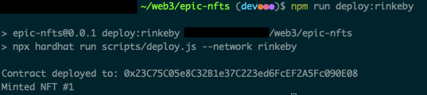

## Section_1

### Lesson 2

### Lesson 3

### Lesson 4

[JSON](https://jsonkeeper.com/b/QZJQ)

[Contract Deployment - Etherscan](https://rinkeby.etherscan.io/address/0x9F5A77b9aE29Ecd50879786F36CcD7E51BcF3fd6)

[Testnet Opensea Collection](https://testnets.opensea.io/collection/squarenft-eswzi6ugv0)

---

## Section_2

### Lesson 2

[Contract Deployment - Etherscan](https://rinkeby.etherscan.io/address/0x23c75c05e8c32b1e37c223ed6fcef2a5fc090e08)

[Testnet Opensea Collection](https://testnets.opensea.io/collection/squarenft-8mw8176prp)

### Lesson 3

[Contract Deployment](https://rinkeby.etherscan.io/address/0xf5abcfdefc91cb865d6f3a458f6ceeee8871ec1b)

[Testnet Opensea Collection](https://testnets.opensea.io/collection/squarenft-qpanboo3cj)

### My Collection

###### I deployed 3 contracts with bad metadata formatting before testing locally... Lesson learned! Will test locally first from now on ;-)

---

## Section 3

### Lesson 1

### Lesson 2

